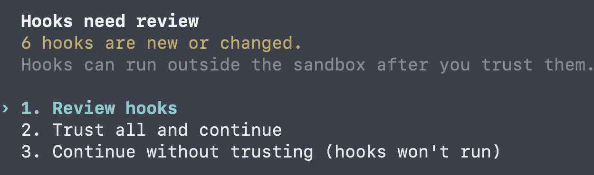
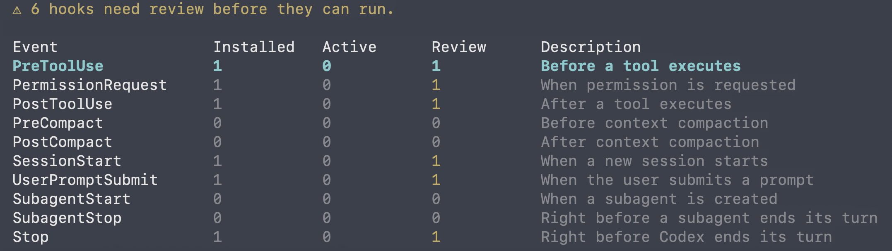
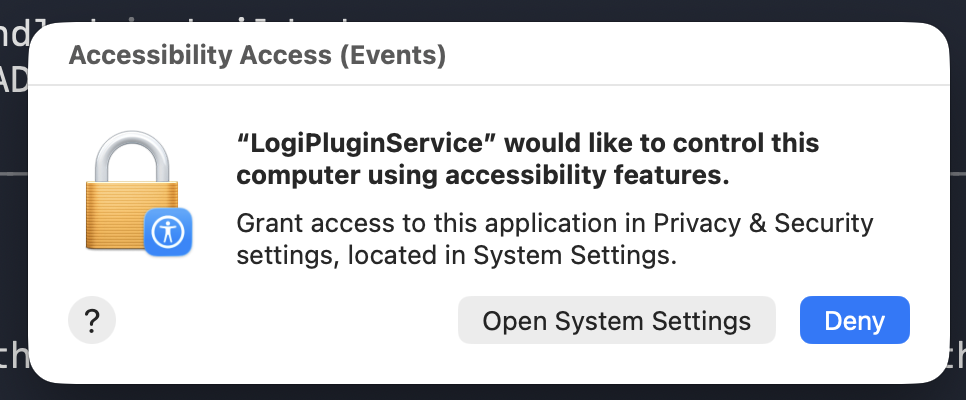
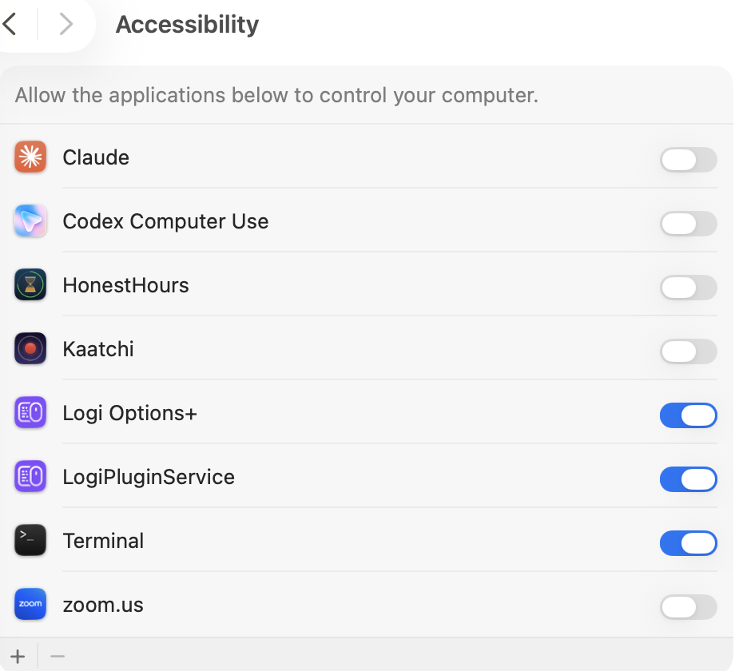
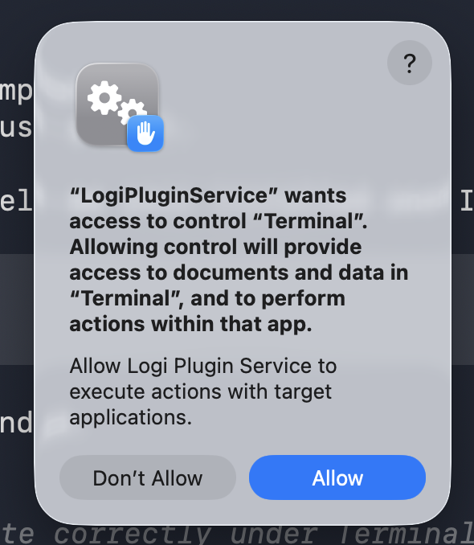
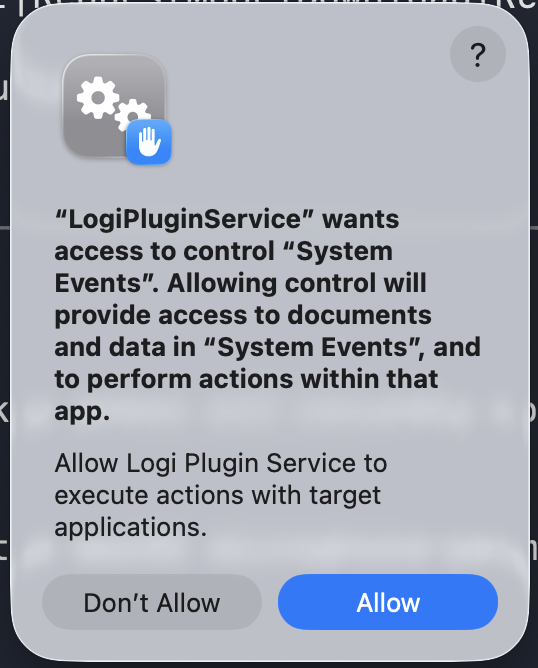
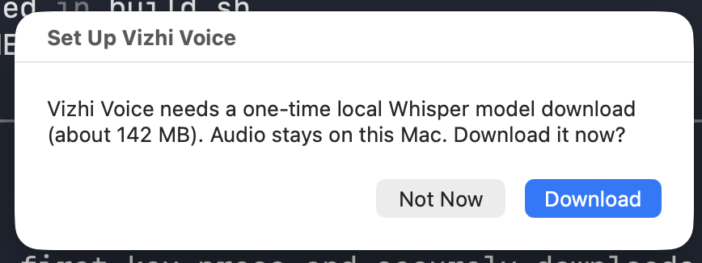
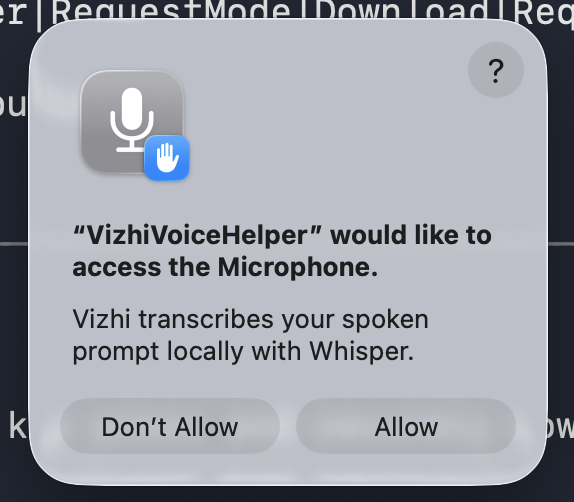

# Vizhi

> **Vizhi (விழி)** — Tamil for *"eye."* Vizhi watches your Codex agents so you do not have to.

Vizhi is live supervision for Codex CLI sessions in two places: a **Logitech MX Creative Keypad** plugin and a **local browser dashboard**. See each session's state at a glance, then approve, interrupt, redirect, or add context with a key press. It is designed for macOS and Terminal.app; the browser dashboard does not require a keypad.

**Try the replay in 60 seconds** — Node.js only; no keypad, Codex account, or macOS required:

```sh
npm install
npm run demo
```

Open the printed URL to watch a recorded supervision session play back live.

## Built with Codex + GPT-5.6

Vizhi was built for OpenAI Build Week through iterative Codex sessions. During the final implementation, the live session grid used to supervise terminal work also served as the project's own development control surface.

Key design decisions developed with Codex:

- **One local action pipeline.** The browser and keypad create the same normalized action records, so both surfaces deliver commands through one router instead of drifting into separate implementations.
- **Safe file-queue delivery.** Actions are claimed by moving them into `actions/done/`; malformed records are quarantined and completed records expire. This prevents duplicate delivery and one bad action from blocking later input.
- **TTY-verified approvals.** Before Vizhi sends an approval response, it verifies the target Terminal tab by TTY. That keeps an approval tied to the Codex session that requested it, even when sessions move between slots.
- **Live Codex controls, not hardcoded choices.** Model, reasoning, mode, and approval controls open Codex's own current pickers rather than encoding an outdated list in the plugin.

GPT-5.6 was used in Codex for high-reasoning architecture and safety reviews, especially around approval delivery, the local dashboard token model, and the shared action path. Routine UI, documentation, and parity work used lighter-weight iterative sessions. The primary Codex session ID is submitted through Devpost's `/feedback` flow.

## What you need

- Codex CLI, signed in and usable from Terminal.app.
- macOS Terminal.app for actions that focus a terminal, type text, or press keys.
- For the physical keypad: Logi Options+, an MX Creative Keypad, and the Vizhi `.lplug4` plugin package.
- Only for the optional browser dashboard: a current Node.js LTS release.
- Only when building the plugin yourself: the .NET 10 SDK and `logiplugintool` from the Logi Actions SDK.
- Only for physical offline Voice: `whisper-cli` once (for example, `brew install whisper-cpp`). Vizhi installs its helper automatically and asks before downloading its local Whisper model.

## Keypad install

For normal keypad use, install the plugin once. You do not need `npm`, `npm run router`, or a separate background Terminal window.

### 1. Install Vizhi

Install Vizhi from the Logi Marketplace when it is published. For a local `.lplug4` build, open the package with Logi Options+ or use the Logi Actions SDK tool:

```sh
logiplugintool install VizhiPlugin/bin/Vizhi_3.10.4.lplug4
```

The package contains the default six-session Vizhi profile, including Yes, No, Voice, commands, prompts, navigation, and Git pages. No individual actions need to be dragged onto keys.

### 2. Use Vizhi under Terminal

The default profile is registered under **Terminal**, not as a separate Vizhi application. When Terminal.app is frontmost, Logi Options+ selects the Terminal profile automatically. If you have several Terminal profiles, choose **Vizhi** under Terminal once; Logi keeps your choice and custom profiles.

### 3. Start Codex normally

When Vizhi first loads, it installs its small bundled local hook into `~/.codex/config.toml` and keeps a one-time backup at `~/.codex/config.toml.vizhi.bak`. Restart any already-running Codex session. At Codex's one-time hook-trust prompt, review the hooks and choose **Trust all and continue** to enable Vizhi's live Grid; the prompt is explained in the [first-use setup walkthrough](#first-use-setup-walkthrough).

Start or resume Codex normally in Terminal.app. New sessions appear on the earliest free session key as soon as Codex starts; keypad actions are handled automatically by Logi Plugin Service.

### First-use prompts

Two approvals cannot and should not be automated: Codex asks you to trust Vizhi's local hooks, and macOS may ask Logi Plugin Service for Accessibility or Terminal Automation permission. Approve them only after confirming Vizhi is installed.

## Optional browser dashboard

The browser dashboard is optional. When the keypad plugin is installed and loaded, it uses the plugin's built-in local action service:

```sh
npm install
npm start
```

Open the complete URL printed by `npm start`. Do not shorten it: the `token=...` part gives that browser tab access to your local dashboard.

For browser-only development without the keypad plugin, install the Node hook once and keep the legacy router running:

```sh
node dist/cli.js install-codex-hooks
npm run router
```

## Permissions in plain terms

Vizhi does not need an administrator password, Full Disk Access, Input Monitoring, or access to a cloud account. The live Grid only needs Codex hook trust. macOS asks for further access only when you use features that control Terminal, type keys, record Voice, or capture a screenshot.

- **Codex hook trust — required for live session cards.** The installed plugin adds a marked Vizhi hook block locally. At the Codex prompt, select **Trust all and continue** after reviewing it; the six events call one local Vizhi hook that writes session state and never bypasses Codex approvals.
- **Accessibility for Logi Plugin Service — needed for keypad actions.** This lets Vizhi bring the right Terminal tab forward and send keys such as Yes, No, Esc, or a prompt. Go to **System Settings → Privacy & Security → Accessibility** and enable **LogiPluginService** if macOS asks. Vizhi does not require the separate **Logi Options+** or **Terminal** entries to be enabled.
- **Automation for Terminal — needed when macOS asks.** Allow **Logi Plugin Service** to control Terminal.app so Vizhi can select the matching tab. This is only for Terminal.app actions.
- **Automation for System Events — needed when macOS asks.** Allow **Logi Plugin Service** to control System Events so Vizhi can send real keys to Codex, including Yes, No, Voice text, Esc, and menu navigation.
- **Microphone — optional Voice only.** Browser Voice asks your browser for microphone access. After physical Voice finishes its one-time setup, `Vizhi Voice Helper` asks for access.
- **Screen Recording — optional Screenshot only.** Allow it only if macOS asks when you use Vizhi's Screenshot action through Logi Plugin Service.

The `Clipboard` action sends your current clipboard text to the selected Codex session. The `Screenshot` action keeps a local image for up to 15 minutes so Codex can inspect it after you send the prompt.

### First-use setup walkthrough

Codex hook trust comes first, followed by macOS feature permissions. The wording and appearance vary slightly between releases. Only approve access when you want to use its matching feature; macOS adds app entries automatically, so do not add anything manually.

<details>
<summary>Show the first-use setup screenshots</summary>

#### 0. Trust the six local Vizhi Codex hooks

This is a Codex safety review, not a macOS permission. Codex shows six lifecycle events because Vizhi needs reliable live state: session start, submitted prompts, tool activity, approval requests, completed tools, and the end of a turn. They all call the same bundled local Vizhi hook; it writes local session-state files and never approves actions on your behalf.

Choose **Review hooks** to inspect the list, then choose **Trust all and continue** when you are satisfied. Choosing **Continue without trusting** leaves Codex usable, but Vizhi cannot reliably show new sessions, Working/Ready state, or approval requests.





#### 1. Allow LogiPluginService accessibility

macOS first explains why LogiPluginService needs Accessibility. Choose **Open System Settings**, then enable **LogiPluginService** in the Accessibility list. This is required for keypad actions that send keys to Codex.





The list may also show **Logi Options+** and **Terminal**. Those switches are not required by Vizhi itself.

#### 2. Allow Terminal and System Events automation

Allow Terminal control so Vizhi can select the correct Codex tab, then allow System Events so it can send keystrokes such as Yes, No, Voice text, Esc, and navigation.





#### 3. Set up optional local Voice

The first physical Voice press asks before downloading the one-time local Whisper model. It then asks for microphone access for the separate `VizhiVoiceHelper` app. The audio remains local to the Mac for transcription.





Screen Recording is not shown above because macOS requests it only when you tap the optional Screenshot action.

</details>

## Run the demo

```sh
npm install
npm run demo
```

Open the complete URL printed by the command. The replay needs only Node.js; it does not need a keypad, Codex, or macOS.

## Related approaches

Several projects are exploring ambient supervision for coding agents. Vizhi focuses on the Codex CLI workflow in Terminal.app and keeps the hardware optional.

| Project | Integration surface | Supervision surface | How it differs from Vizhi |
| --- | --- | --- | --- |
| [Codex Micro](https://openai.com/supply/co-lab/work-louder/) | ChatGPT Codex and Work Louder Input | Custom 13-switch controller with real-time RGB agent state | Vizhi targets Codex CLI hooks in Terminal.app and works either on an existing Logitech keypad or in a browser. |
| [AgentDeck](https://github.com/puritysb/AgentDeck) | Multi-agent bridge with hook- and PTY-based state | Stream Deck, mobile, display, and terminal surfaces | Vizhi is deliberately narrower: a focused Codex CLI workflow with a six-session LCD grid, TTY-verified approvals, and a browser fallback. |
| [agent-deck](https://github.com/asheshgoplani/agent-deck) | Multiple terminal-based coding agents | Terminal TUI | Vizhi moves the status and response loop off the terminal while preserving Terminal.app as the execution surface. |
| **Vizhi** | Codex CLI lifecycle hooks in Terminal.app | Logitech MX Creative Keypad or local browser dashboard | Project name, state, context percentage, risk-aware approvals, offline Voice, screenshot-plus-Voice context, and a local Session Library. |

The common thread is that agent supervision matters. Vizhi's contribution is a lightweight physical-or-browser control loop for the Codex CLI environment people already use.

## Lineage

Vizhi is informed by [Claude Console](https://github.com/rshankras/claude-console), an earlier Logitech MX Creative Keypad controller for Claude Code. This Build Week project adds a Codex CLI adapter built on lifecycle hooks, a shared local action and state layer for keypad and browser controls, a multi-session risk-aware grid, a browser dashboard and Session Library, screenshot-plus-Voice staged prompts, and a replayable demo. A Claude adapter on the new core remains a follow-up milestone.

## Local IPC

This is technical detail for troubleshooting. Most users can skip it.

- Session state: `/tmp/vizhi/sessions/<session-id>.json`
- Slot registry: `/tmp/vizhi/registry.json`
- Browser actions: `/tmp/vizhi/actions/<uuid>.json`
- Captures: `/tmp/vizhi/captures/<timestamp>.png`

Use `--ipc-root <path>` with any command to isolate local runs and tests. Vizhi creates its IPC directories with owner-only permissions, writes new state/action files with owner-only permissions, and binds the browser only to `127.0.0.1`. The dashboard uses a fresh local token each time it starts, so its API and event stream cannot be called without loading that dashboard first.

## Browser dashboard details

The browser dashboard shares the same live session state as the keypad. Select a session card, then use its controls for Yes/No, Esc, Compact, New, Exit, Fork, New Tab, New Window, Model, Mode, Agent, Tab and menu navigation, all prompt templates, and all Git workflows. `Fork` starts `codex fork` in a new Terminal tab with the selected session's project directory. `New Tab` and `New Window` open plain Terminal shells in that project folder. The live usage panel shows context, cost, model, and reasoning. Browser-issued commands return you to the dashboard; choose `Open Terminal` only when you want to stay in the selected Codex tab.

The prompt box sends its text to the selected Codex session. Browser `Voice` uses the browser's speech-recognition support when available and sends the completed transcript immediately, matching the physical Voice key; typed prompts work in every supported browser. The `Clipboard` action deliberately asks for confirmation before pasting plaintext into the selected session. `Screenshot` opens macOS's area selector, saves the capture under `/tmp/vizhi/captures/`, and stages its local image path in the selected Codex prompt without submitting. Captures expire after 15 minutes, giving Codex enough time to inspect the staged path without retaining images indefinitely. Tap either Voice control to add spoken context and send both automatically, or add typed context and press `Enter`. The installed keypad plugin delivers browser actions automatically; browser-only development still needs `npm run router`.

The Session Library is browser-only. It shows recent completed Codex sessions and archived sessions without reading conversation messages. `Resume` opens a saved session in a new Terminal tab; `Archive` is confirmation-gated and refuses to archive a currently live Vizhi slot; `Restore` returns an archived session to Codex's normal resume list.

## Troubleshooting

- **The browser says `unauthorized`:** stop `npm start`, run it again, and open the newly printed full URL. Each start creates a new local token.
- **A new Codex session does not appear:** confirm the Vizhi profile is active under Terminal, restart Codex after the trust prompt, and start Codex in Terminal.app.
- **A key press does nothing:** check the Accessibility and Automation permissions above, then quit and reopen Logi Options+.
- **Vizhi does not appear in Logi Options+:** reinstall the `.lplug4` package, then quit and reopen Logi Options+.

## Development

```sh
npm test
```

## Logitech MX Creative Keypad

### Included default profile

The packaged Vizhi profile arrives with five ready-to-use pages. The first page contains the six Session capacity keys left to right and top to bottom, plus `Yes`, `No`, and `Voice` on the bottom row. The next pages contain Commands, Prompts, Navigate, and Git controls. You can still customize a copy in Logi Options+ without changing the packaged default.

The six Session keys are capacity keys, not permanently assigned terminals. The first active Codex session uses Session 1, the next uses Session 2, and remaining sessions move forward when one exits. A black key means no session is available. Each occupied key shows the project name and context percentage: teal means ready, purple means working, and amber or red means attention is needed. A small blue marker shows which session will receive Yes, No, and Voice.

The six session keys plus fixed `Yes`, `No`, and `Voice` controls remain the primary dashboard. Put the following optional actions on a separate Logi Options+ page or profile so they do not displace that muscle-memory layout:

- `Vizhi Commands`: `Esc` interrupts the selected session, `Compact` sends `/compact`, `New` sends `/new`, `Exit` sends Codex's `/exit` command without deleting the saved session, `Fork` branches the selected session into a new Terminal tab, `Model` opens Codex's live model and reasoning picker, `Mode` opens Codex's live mode and approval picker, and `Agent` opens Codex's `/agent` subagent-thread picker. `Favorite` runs the user-selected prompt template and keeps its own star label even when it is configured to run Review. Vizhi never hardcodes models, reasoning levels, or approval modes.
- `Vizhi Terminal`: `New Tab` and `New Window` open plain Terminal shells in the focused session's project folder, or your home folder when no session is selected. They do not start a new Codex session.
- `Vizhi Navigate`: `Tab`, `Up`, `Down`, `Enter`, `Page Up`, and `Page Down` send the matching physical key to the selected Terminal.app session. Use them for Codex menus and scrolling. `Tab` cannot accept Codex's gray placeholder text because it is not an inline suggestion; it only sends a real Tab key to controls that support Tab completion. Codex's Model and Mode pickers use `Up`, `Down`, and `Enter` instead.
- `Vizhi Context`: `Clipboard` pastes the current macOS text clipboard into the selected session. `Screenshot` opens the macOS area selector, saves a PNG under `/tmp/vizhi/captures/`, and stages its path in the prompt. Its key changes to `Draft`; tap `Voice` to add spoken context and send both together automatically. Or add typed context and press `Enter`. Place these on an optional page because they intentionally move private local context into a prompt.
- `Vizhi Status`: `Usage` displays the selected session's context percentage plus current cost when available, otherwise its model and reasoning level. Pressing it focuses that session.
- `Vizhi Prompts`: `Fix Bug`, `Write Tests`, `Explain`, `Refactor`, `Review`, `Security`, `Plan`, `Handoff`, and `Safe Revert` send focused, built-in coding prompts to the selected session. `Plan` explores and waits before editing; `Handoff` summarizes work for a new session; `Safe Revert` inspects and explains risk before waiting for explicit confirmation to modify files.
- `Vizhi Git`: `Commit`, `Diff`, `Push`, `Create PR`, `Status`, and `Git Log` send safe Git workflows to the selected session. Actions such as Push and Create PR still use Codex's normal approval flow and never force-push.

Every prompt and Git workflow works immediately and can be customized independently. For example, replace the `Fix Bug` workflow:

```sh
npm run prompt:set -- --id fix_bug --label Repair --prompt "Investigate the reported bug, implement the smallest safe fix, and add regression coverage."
```

Available IDs are `fix_bug`, `write_tests`, `explain`, `refactor`, `review`, `security`, `plan`, `handoff`, `safe_revert`, `commit`, `diff`, `push`, `create_pr`, `status`, and `log`. Omitting `--id` preserves the older shorthand and edits `review`. Set the physical and browser Favorite action with:

```sh
npm run prompt:favorite -- --id plan
```

Configurations are stored at `~/.vizhi/prompt-templates.json`; an existing `~/.vizhi/prompt-template.json` Review override continues to work. The selected session receives the full prompt while the key shows its short label. Reload the plugin if a changed label is not immediately visible.

Use the normal build while developing. Use the development build only when you want Logi Plugin Service to create or refresh its `.link` development plugin:

```sh
npm run plugin:build
npm run plugin:dev
```

Create a distributable package with one repeatable build, pack, and verification command:

```sh
npm run plugin:package
```

It writes `VizhiPlugin/bin/Vizhi_3.10.4.lplug4`, including `profiles/DefaultProfile70.lp5`, the bundled Codex hook, and the physical Voice helper. The package version reflects pre-public development iterations rather than prior public Vizhi releases. Before publishing to Logi Marketplace, set real `supportPageUrl` and `homePageUrl` values in `VizhiPlugin/src/package/metadata/LoupedeckPackage.yaml`, increment the semantic version, and test the package on physical supported hardware.

### Embedded action service

Logi Plugin Service starts Vizhi's embedded action service with the plugin. It finds the matching Terminal.app tab, brings it forward, and types safely; it also watches for new Codex sessions before the first prompt. When `exit` ends Codex, it releases that session key even if the Terminal tab remains open. Keyboard Escape bypasses Vizhi, so a stopped task can take up to 45 seconds to change from Working to Ready; use Vizhi's `Esc` key when you need the status to update immediately.

The embedded service claims each action by moving it into `/tmp/vizhi/actions/done/` before execution, then removes completed and quarantined action records after one hour. It quarantines malformed action files in `/tmp/vizhi/actions/failed/` so one bad file cannot block later keypad input. It verifies the selected tab by TTY before sending an approval response. `approve`, `deny`, and offline `voice` actions are supported.

### Physical offline Voice (optional)

Assign the `Voice` action from the `Vizhi Operate` group to a keypad key. Press once to record (the key changes to an animated green Listening face), speak, then press it again to transcribe. Vizhi sends the transcript immediately. When the selected session has a staged Screenshot draft, it includes the screenshot path and spoken context in that same submission. Transcription runs locally through `whisper-cli`; its temporary audio and transcript files live in a private Vizhi runtime directory and are cleared after transcription.

On the first `Voice` press, Vizhi installs its bundled helper into your private local runtime. If needed, it asks before downloading the one-time local Whisper model (about 142 MB). When that download finishes, macOS asks for Microphone permission for `Vizhi Voice Helper`; approve it, then tap `Voice` again to record. No setup script is required. `whisper-cli` must still be installed first, for example with `brew install whisper-cpp`. Normal physical Voice focuses the selected Terminal.app session and sends the transcript directly. Screenshot-plus-Voice uses the same embedded action service as Screenshot capture. Browser Voice does not use Whisper; it uses your browser's microphone permission instead.

The implementation currently covers the Grid, normalized state, Codex event mapping, risk coloring, virtual-deck action files, Terminal.app focus routing, and offline voice dictation. The Claude adapter remains a follow-up milestone.
